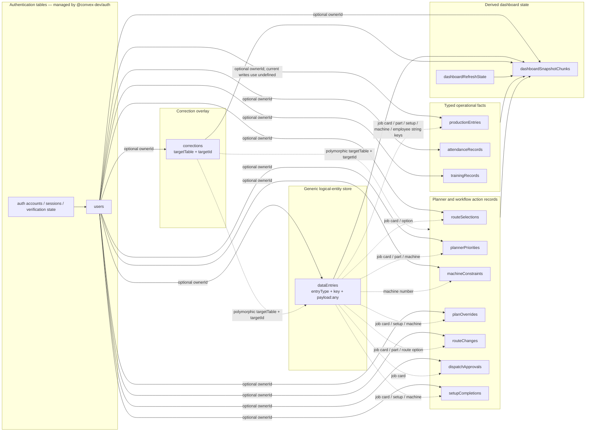
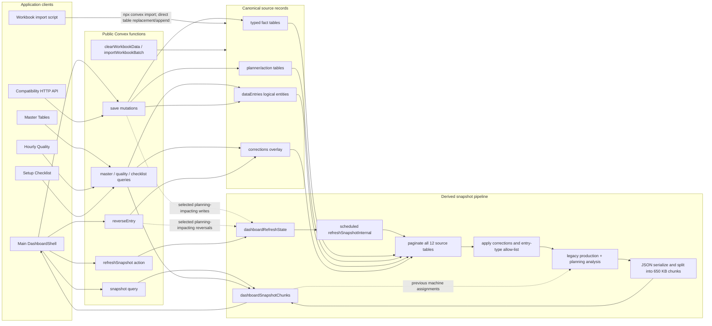

# MRM Dashboard Convex Static Schema and Data-Flow Audit

Date: 2026-07-18

Status: Static audit complete; PostgreSQL migration specification not yet defined.

## Scope and constraints

This document describes the current persisted schema and data flows in
`mrm-dashboard` before a PostgreSQL migration is specified.

The audit was deliberately static:

- No Convex CLI commands were run.
- No cloud deployment was queried.
- No local or self-hosted Convex backend was started.
- No Docker or development server was started.
- No production data, row counts, runtime logs, or deployment insights were
  inspected.
- Findings come from the checked-in schema, functions, client call sites,
  import script, domain analysis code, tests, documentation, and code knowledge
  graph.

Primary sources:

- `apps/web/convex/schema.ts`
- `apps/web/convex/dashboard.ts`
- `apps/web/convex/auth.ts`
- `apps/web/components/mrmpl-dashboard.tsx`
- `apps/web/lib/legacy-dashboard-analysis.ts`
- `apps/web/lib/dashboard-corrections.ts`
- `apps/web/lib/planning-refresh-policy.ts`
- `apps/web/app/api/[...path]/route.ts`
- `apps/web/scripts/import-workbook.mjs`

## Executive findings

1. The application defines 14 Convex tables in addition to the authentication
   tables supplied by `@convex-dev/auth`.
2. The 14 application tables have 22 explicit Convex indexes.
3. Ten tables are typed operational facts or planner/action records. One
   table, `dataEntries`, stores most of the actual domain model as
   `entryType + key + payload: any`.
4. `dataEntries` currently represents at least 25 active logical entity types,
   plus legacy/fallback types that remain in the analysis code.
5. Most relationships are soft string relationships such as job-card number,
   part code, setup number, employee ID, and machine number. The database does
   not enforce them.
6. `ownerId` is the only application-defined Convex document reference, but
   current writes intentionally set it to `undefined`, making operational rows
   global.
7. The primary dashboard read is not a normalized query. It reads a serialized,
   derived snapshot assembled from 12 source tables and stored in
   `dashboardSnapshotChunks`.
8. Rebuilding the snapshot scans every page of every source table, applies
   correction overlays, runs the legacy planning/analysis engine, serializes
   the complete result, and replaces the chunk cache.
9. Corrections are append-only reversal records with polymorphic
   `targetTable + targetId` references. The target records remain in their
   original tables.
10. Static code shows mismatches between the `dataEntries` types admitted into
    the snapshot and the types consumed by the analysis layer.
11. Static analysis cannot determine production row counts, payload-shape
    drift, duplicate logical keys, orphan corrections, owner-scope
    distribution, or actual read/write frequency. Those require a later,
    authorized data export or database inspection.

## Physical schema map

The following map shows physical Convex tables and the principal inferred
relationships. Solid conceptual relationships are backed by a Convex ID.
Dashed/labelled relationships are string or polymorphic relationships inferred
from code.



## Physical table inventory

### Authentication tables

`schema.ts` spreads `authTables` from `@convex-dev/auth/server`. The package is
locked at `@convex-dev/auth@0.0.94`. The application does not define those
tables locally, so their exact deployed contents and migration requirements
must be inventoried separately from the application tables.

`apps/web/convex/auth.ts` configures password authentication only.

### Application tables

| Table                     | Purpose                                                                                            | Important fields                                                                                 | Explicit indexes                                                            | Relationship notes                                                                                |
| ------------------------- | -------------------------------------------------------------------------------------------------- | ------------------------------------------------------------------------------------------------ | --------------------------------------------------------------------------- | ------------------------------------------------------------------------------------------------- |
| `productionEntries`       | Typed production output, rejection, and downtime facts                                             | `prodDate`, `operatorId`, `machineType`, `machine`, `partCode`, `jobCard`, `setupNo`, quantities | `by_owner`, `by_owner_date`, `by_owner_machine_type`, `by_owner_machine`    | Operator, machine, job card, part, and setup are strings rather than foreign keys                 |
| `attendanceRecords`       | Monthly attendance aggregate per operator                                                          | `operatorId`, `monthKey`, working/present days, score                                            | `by_owner`                                                                  | `operatorId` soft-links to employee master                                                        |
| `trainingRecords`         | Employee/operator training history                                                                 | `operatorId`, department, date, type, trainer, status                                            | `by_owner`                                                                  | Employee and trainer are strings                                                                  |
| `routeSelections`         | Selected route option for a job card                                                               | `jcNo`, `optionNumber`                                                                           | `by_owner`                                                                  | Soft-links to work order and route                                                                |
| `plannerPriorities`       | Planner priority decision and interruption/queue payload                                           | target, job card, part, priority, nested interrupted setups and queue blockers                   | `by_owner`                                                                  | Nested arrays encode relationships that would normally be child rows                              |
| `machineConstraints`      | Machine unavailability and reviewed re-planning decisions                                          | machine, date window, reason, nested interruptions and queue placements                          | `by_owner`                                                                  | Machine/job/setup relations are strings inside nested objects                                     |
| `planOverrides`           | Part/setup-specific machine move                                                                   | target, source/target machine, setup, interruptions, queue placements                            | `by_owner`                                                                  | Soft-links to work order/part/setup/machines                                                      |
| `routeChanges`            | Route-option change and remaining setup plan                                                       | target, new option, setup boundaries, WIP, nested remaining setups                               | `by_owner`                                                                  | Nested setup plan should be separately modelled for relational integrity                          |
| `dispatchApprovals`       | Dispatch approval event                                                                            | `jcNo`, `approvedBy`, remark                                                                     | `by_owner`                                                                  | Approver is client-supplied text                                                                  |
| `setupCompletions`        | Job/setup completion event                                                                         | `jcNo`, `setupNo`, machine, `completedBy`                                                        | `by_owner`                                                                  | Completer is client-supplied text                                                                 |
| `dataEntries`             | Generic storage for masters, work orders, workflow state, quality, maintenance, and legacy imports | `entryType`, optional `key`, `payload:any`                                                       | `by_owner`, `by_entry_type`, `by_entry_type_key`, `by_owner_entry_type_key` | No uniqueness constraint; payload fields and soft relationships are not validated by the database |
| `corrections`             | Append-only reversal overlay                                                                       | target table/id/key/label, action, reason, actor, optional corrected payload                     | `by_owner`, `by_target`, `by_owner_target`                                  | Polymorphic target; no database-enforced target existence                                         |
| `dashboardSnapshotChunks` | Serialized derived dashboard/planning snapshot                                                     | owner, sequence, string chunk, updated timestamp                                                 | `by_owner`                                                                  | Derived cache, not canonical business data                                                        |
| `dashboardRefreshState`   | Singleton refresh/coalescing state machine                                                         | key, status, requested/scheduled/started/completed timestamps, error                             | `by_key`                                                                    | Code expects one row for the constant key                                                         |

All application timestamps are stored as strings or millisecond numbers rather
than a single consistent temporal type.

## `dataEntries` as a hidden logical schema

The physical `dataEntries` table is a discriminated JSON store. The logical
key is generated in the client or compatibility API, then used for a
query-then-patch upsert. Convex indexes accelerate lookup but do not enforce
logical-key uniqueness.

### Actively modelled logical entities

| `entryType`                     | Logical role                                         | Current logical key                                                                                 |
| ------------------------------- | ---------------------------------------------------- | --------------------------------------------------------------------------------------------------- |
| `route`                         | Part route/setup master                              | part + option + setup                                                                               |
| `cycle`                         | Setup cycle/loading time master                      | part + option + setup                                                                               |
| `tooling`                       | Setup tooling/fixture master                         | part + option + setup                                                                               |
| `work_order`                    | Job card/order master                                | job-card number                                                                                     |
| `rm_inward`                     | Raw-material inward status                           | job-card number                                                                                     |
| `employee`                      | Shop-floor employee/operator master                  | employee ID                                                                                         |
| `machine_master`                | Physical machine master                              | machine number                                                                                      |
| `planning_holiday`              | Plant/machine/department planning calendar exception | date + scope + machine + department                                                                 |
| `setup_checklist_master`        | Versioned setup checklist step                       | version + sequence + checkpoint                                                                     |
| `setup_checklist_session`       | Checklist instance copied for a job/setup/machine    | session ID, else job + part + option + setup + machine                                              |
| `shop_floor_status`             | Current setup lifecycle progress/lock                | job + part + option + setup + machine                                                               |
| `first_piece_inspection_report` | Completed FPIR for a setup/machine                   | job + part + option + setup + machine                                                               |
| `quality_parameter_master`      | Shared FPIR/hourly inspection parameter              | part + option + setup + generated parameter code                                                    |
| `hourly_quality_check`          | Hourly inspection card                               | check ID, else date + shift + hour + machine + part + option + setup                                |
| `production_card`               | Role-specific production/downtime/rejection card     | card ID/date/job/part/setup/machine composite                                                       |
| `software_raw`                  | Legacy/software production output                    | production-card/date/job/part/setup/machine composite; UI saves this to `productionEntries` instead |
| `maintenance_master`            | Reusable maintenance definition                      | maintenance code                                                                                    |
| `maintenance_checklist_master`  | Maintenance checklist step                           | checklist code + sequence                                                                           |
| `maintenance_schedule`          | Machine-specific maintenance assignment              | machine + maintenance code                                                                          |
| `maintenance_task`              | Planned/breakdown maintenance completion history     | task ID, else machine + type + code + completion date/time                                          |
| `rejection_type_master`         | Quality rejection type code                          | code                                                                                                |
| `rejection_reason_master`       | Shared defect/downtime reason code                   | code                                                                                                |
| `rejection_remark_master`       | Rejection remark code                                | code                                                                                                |

### Legacy, fallback, or drifted logical types

The snapshot allow-list and the analysis consumers do not describe the same set
of logical types.

Snapshot allow-list entries that are not directly consumed by the current
`buildLegacyDashboardSnapshot` bucketing path include:

- `rejection_classification`
- `raw_material_plan`
- `machine_planning`
- `quality_inspection`

Analysis consumers that are absent from the snapshot allow-list include:

- `setup_checklist`
- `downtime_reason_master`
- `rejection_type_master`
- `rejection_reason_master`
- `rejection_remark_master`
- `meeting_action`

Other compatibility types include:

- `dispatch`
- `first_piece_inspection_master` as a read-only legacy fallback
- `_summary`

This does not prove data loss at runtime, but it proves that the static producer
allow-list and consumer expectations have drifted. The migration inventory must
check whether rows exist for every known `entryType`, including types absent
from either list.

## Soft relationship map

The current domain joins depend on normalized strings rather than database
foreign keys.

| Concept                | Current identifiers                                    | Referenced from                                                                                             |
| ---------------------- | ------------------------------------------------------ | ----------------------------------------------------------------------------------------------------------- |
| Employee/operator      | `employee.empId`, `operatorId`                         | production, attendance, training, production cards, workflow actor fields                                   |
| Job card/work order    | `work_order.jcNo`, `jobCard`, `jcNo`, generic `target` | production, RM inward, route selection, priorities, route changes, approvals, completions, workflow records |
| Part                   | `partNo` / `partCode`                                  | routes, cycles, tooling, work orders, production, inspections, planning actions                             |
| Route option           | `optionNumber`                                         | route, work order, selection, route change, checklist/quality/workflow records                              |
| Setup                  | `setupNo` with legacy aliases                          | route, cycle, tooling, production, planner actions, quality, shop-floor workflow                            |
| Machine family         | `machineUsed` / route machine                          | route and planning analysis                                                                                 |
| Physical machine       | `machine_master.machineNo`, `machine`, `machineNo`     | production, constraints, overrides, workflow, quality, maintenance                                          |
| Quality parameter      | generated `P#`/code within part-option-setup           | hourly checks and FPIR readings                                                                             |
| Maintenance definition | `maintenanceCode`                                      | machine maintenance schedules and tasks                                                                     |
| Maintenance checklist  | `checklistCode` + sequence                             | maintenance definition, schedule, task snapshots                                                            |

Aliases and spreadsheet-era header normalization are pervasive. For example,
the analysis accepts combinations such as `PART NO`, `PART CODE`, `partNo`, and
`partCode`. A PostgreSQL migration cannot safely infer canonical columns from
one UI form alone.

## Public Convex function inventory

### Queries

| Function                  | Reads                                                                     | Output/use                                                                 |
| ------------------------- | ------------------------------------------------------------------------- | -------------------------------------------------------------------------- |
| `currentDashboardUser`    | auth `users` by authenticated ID                                          | User ID/email/name for display and selected audit fields                   |
| `snapshot`                | `dashboardSnapshotChunks`                                                 | Main reactive dashboard payload, optionally filtered after deserialization |
| `masterTableRows`         | paginated `dataEntries`; per-row `corrections` lookups                    | Direct master browsing outside the snapshot                                |
| `hourlyQualityPage`       | snapshot chunks; all `quality_parameter_master` rows by entry type        | Current running setups plus quality parameters                             |
| `hourlyQualityCheckByKey` | keyed `dataEntries`; per-row corrections                                  | Existing hourly check card                                                 |
| `setupChecklistPage`      | setup master rows; keyed session rows; corrections for session rows       | Lightweight checklist page                                                 |
| `refreshStatus`           | singleton `dashboardRefreshState`                                         | Reactive refresh progress                                                  |
| `status`                  | newest row from each of 12 source tables                                  | Compatibility status/version response                                      |
| `correctionCandidates`    | up to 200 newest rows from eight target tables; corrections per candidate | Corrections screen                                                         |

### Mutations and action

| Function                 | Reads                                                                                 | Writes / side effects                                                                                        |
| ------------------------ | ------------------------------------------------------------------------------------- | ------------------------------------------------------------------------------------------------------------ |
| `refreshSnapshot` action | snapshot freshness                                                                    | Queues internal refresh state; does not rebuild inline                                                       |
| `saveProductionEntry`    | authentication/global owner                                                           | Inserts `productionEntries`; queues refresh                                                                  |
| `saveAttendanceRecord`   | authentication/global owner                                                           | Inserts `attendanceRecords`; does not queue refresh                                                          |
| `saveTrainingRecord`     | authentication/global owner                                                           | Inserts `trainingRecords`; does not queue refresh                                                            |
| `saveRouteSelection`     | authentication/global owner                                                           | Inserts `routeSelections`; queues refresh                                                                    |
| `savePlannerPriority`    | authentication/global owner                                                           | Inserts `plannerPriorities`; queues refresh                                                                  |
| `saveMachineConstraint`  | authentication/global owner                                                           | Inserts `machineConstraints`; queues refresh                                                                 |
| `savePlanOverride`       | authentication/global owner                                                           | Inserts `planOverrides`; queues refresh                                                                      |
| `saveRouteChange`        | authentication/global owner                                                           | Inserts `routeChanges`; queues refresh                                                                       |
| `saveDispatchApproval`   | authentication/global owner                                                           | Inserts `dispatchApprovals`; does not queue refresh                                                          |
| `markComplete`           | authentication/global owner                                                           | Inserts `setupCompletions`; queues refresh                                                                   |
| `saveDataEntry`          | `dataEntries`, corrections, and for shop-floor locks `planOverrides` plus corrections | Patches an existing logical key or inserts a row; conditionally queues refresh                               |
| `reverseEntry`           | optionally the target `dataEntries` row                                               | Inserts a `corrections` reversal; conditionally queues refresh                                               |
| `seedSampleData`         | authentication                                                                        | Disabled; no business writes                                                                                 |
| `clearWorkbookData`      | batches from selected source tables                                                   | Deletes imported/fact rows; optionally planner actions; does not clear corrections/snapshot or queue refresh |
| `importWorkbookBatch`    | authentication                                                                        | Inserts up to eleven table families in one mutation; does not queue refresh                                  |

### Internal functions

| Function                      | Role                                                                                            |
| ----------------------------- | ----------------------------------------------------------------------------------------------- |
| `requestDashboardRefresh`     | Coalesces refresh requests and schedules an internal action                                     |
| `beginDashboardRefresh`       | Claims the singleton refresh state                                                              |
| `refreshSnapshotInternal`     | Executes the snapshot rebuild and records success/error                                         |
| `finishDashboardRefresh`      | Completes the state transition and schedules another run if a request arrived during processing |
| `dashboardSnapshotFreshness`  | Reads cached chunk timestamps                                                                   |
| `latestMachinePlanDetailRows` | Rehydrates selected previous plan-assignment fields from the last snapshot                      |
| `collectSnapshotTablePage`    | Paginates one of the 12 canonical snapshot source tables                                        |
| `saveDashboardSnapshot`       | Serializes and replaces global snapshot chunks                                                  |

## Main data-flow map



## Major flow details

### 1. Main dashboard read

`DashboardShell` creates live subscriptions to `snapshot` and `refreshStatus`.
The `snapshot` query:

1. Authenticates the caller.
2. Reads all global snapshot chunks through the `by_owner` index.
3. Sorts and joins the chunk strings.
4. Parses the complete JSON payload.
5. Applies optional dashboard filters after deserialization.

This is a derived read model. It is not the canonical persistence model and
should not be translated directly into PostgreSQL base tables.

### 2. Snapshot refresh

The refresh state machine coalesces requests using one
`dashboardRefreshState` row.

The internal rebuild:

1. Iterates 12 source tables.
2. Paginates each table in pages of 1,000.
3. Does not use a table-specific index or owner predicate in
   `paginateSnapshotTable`.
4. Loads previous machine-plan assignments from the last snapshot.
5. Removes actively corrected rows.
6. Filters `dataEntries` through the snapshot entry-type allow-list.
7. Runs `buildLegacyDashboardSnapshot` and the planning/production analysis.
8. Serializes the entire payload.
9. If unchanged, patches every existing chunk timestamp.
10. If changed, deletes all current chunks and inserts 650,000-character
    chunks.

The `ownerScope` argument exists on `collectSnapshotTablePage`, but
`paginateSnapshotTable` does not use it. Current refreshes therefore scan table
pages without owner filtering.

### 3. Direct lightweight reads

Large/specialized screens increasingly bypass the main snapshot:

- Master tables paginate `dataEntries`.
- Hourly quality uses a smaller query for current running plans and parameter
  masters, then loads a check by logical key.
- Setup checklist loads only checklist master/session data.

These are useful evidence for future PostgreSQL read models, but their
correction behavior is inconsistent:

- `hourlyQualityCheckByKey` and checklist session reads subtract corrections.
- `hourlyQualityPage` does not subtract corrections from quality parameter
  masters.
- `setupChecklistPage` subtracts corrections from the session but not from
  checklist master rows.

### 4. Generic upsert

`saveDataEntry`:

1. Authenticates and assigns global ownership.
2. Performs an additional machine-lock validation for `shop_floor_status`.
3. If a document ID was supplied, patches that document.
4. Otherwise queries up to 20 rows matching owner + entry type + logical key.
5. Subtracts corrected candidates.
6. Patches the latest uncorrected match or inserts a new row.
7. Queues planning refresh only for configured planning-impacting entry types
   and stages.

There is no unique index on `(ownerId, entryType, key)`. Concurrent inserts can
create duplicate live logical records.

`production_card` has special merge semantics: blank fields in a later save do
not overwrite previously non-blank fields, except `savedAt`.

### 5. Shop-floor machine lock

Before saving selected `shop_floor_status` stages, the mutation:

1. Reads up to 1,000 newest `shop_floor_status` entries.
2. Filters global rows in application code.
3. Finds active same-setup locks.
4. Queries corrections separately for every candidate lock.
5. If the target machine differs, reads up to 500 global plan overrides.
6. Again resolves corrections per matching override.
7. Allows the move only when an active planner machine switch exists.

The 1,000/500 caps are business-correctness boundaries, not only performance
limits. Older still-active rows can become invisible to the guard if the
history grows beyond those windows.

### 6. Corrections

Corrections do not mutate their targets. A reversal inserts a row containing:

- Target table
- Target document ID
- Optional logical key/label
- Action (`reverse`)
- Reason
- Corrected-by text
- Timestamp

Read paths query correction rows and compute active target sets. Workflow
corrections can cascade from one shop-floor lifecycle stage to downstream
stages for the same setup.

`activeCorrectionTargetsForRows` performs one indexed correction query per
candidate row. A 200-row page can therefore issue 200 correction queries before
returning.

### 7. Production source precedence

`buildLegacyDashboardSnapshot` chooses production input using this rule:

```text
if any dataEntries/software_raw rows exist:
    use normalized software_raw rows
else:
    use normalized productionEntries rows
```

It does not merge both sources. A single non-empty `software_raw` source causes
the typed `productionEntries` source to be ignored for snapshot analysis.
Production provenance and intended cutover behavior must be settled before
migration.

### 8. Imports and clearing

There are two import paths:

- The browser compatibility API loops over parsed rows and invokes one mutation
  per row.
- `apps/web/scripts/import-workbook.mjs` shells out to `npx convex import` and
  replaces or appends table data directly.

The direct import script bypasses application mutation guards, correction
logic, and refresh queuing.

`clearWorkbookData` deletes in bounded batches but does not delete corrections
or snapshot chunks and does not queue a snapshot refresh. Callers must repeat
until `hasMore` is false.

## Structural risks relevant to PostgreSQL planning

### Critical modelling risks

1. **One physical table hides many bounded contexts.** Porting `dataEntries`
   directly to one PostgreSQL JSONB table would preserve the current ambiguity
   rather than create a relational model.
2. **Logical uniqueness is not enforced.** Composite keys are generated in two
   places—the client and compatibility API—and are not identical for every
   type.
3. **Relationships are unvalidated strings.** Job cards, parts, options,
   setups, machines, employees, maintenance definitions, and quality
   parameters can drift independently.
4. **Production has competing canonical sources.** The current precedence rule
   can suppress a complete typed table.
5. **Correction semantics are application-defined.** A simple data copy without
   reconstructing live/reversed state will produce incorrect operational
   history.

### High integrity risks

1. `ownerId` is optional and current application writes set it to `undefined`.
   Historical owner-scoped rows can coexist with global rows.
2. Authentication exists without roles or permissions. All authenticated users
   can reach broad write functions.
3. Actor fields such as `approvedBy`, `completedBy`, and `correctedBy` are
   client-supplied strings rather than authenticated user references.
4. `payload:any` allows field-name, type, enum, and date-format drift.
5. The shop-floor lock and planner-switch guards inspect capped history windows.
6. Correction targets are polymorphic strings with no target foreign key.
7. The setup/quality master lightweight reads do not consistently subtract
   corrected rows.

### Snapshot consistency risks

1. Attendance, training, and dispatch-approval writes do not queue a refresh
   even though those tables feed the snapshot.
2. Bulk import and clear operations do not queue or rebuild the snapshot.
3. Most master changes intentionally require manual recalculation.
4. Workflow-only changes may be represented optimistically in the browser
   while the snapshot remains stale.
5. Snapshot replacement deletes and reinserts all chunks when the payload
   changes.
6. Refresh state and snapshot state are separate; consumers must interpret
   staleness explicitly.

### Read-amplification risks

1. Snapshot rebuild reads every row from 12 tables.
2. Snapshot consumers receive a large precomputed payload, even when a screen
   needs only one domain.
3. Corrections produce N+1 indexed lookups in several query paths.
4. Quality/setup master reads query by entry type and then filter owner in
   application code.
5. The main snapshot is live-subscribed; replacing or timestamp-patching chunks
   invalidates subscribers.

## Inputs required before writing the PostgreSQL migration specification

The static audit defines what must be measured next, but does not answer these
questions:

1. Row count and storage size for every physical table.
2. Row counts grouped by `dataEntries.entryType`.
3. Every distinct payload field and observed value type per entry type.
4. Duplicate `(ownerId, entryType, key)` groups and blank keys.
5. Rows whose logical keys disagree with the current key generator.
6. Distribution of global versus owner-scoped records.
7. Orphan corrections and corrections targeting already missing rows.
8. Active correction chains and workflow-cascade outcomes.
9. Overlap between `productionEntries` and `software_raw`.
10. Current auth users/accounts/sessions that need migration or invalidation.
11. Maximum snapshot size and chunk count.
12. Legacy entry types that still contain production data.
13. Referential mismatches among job cards, parts, route options, setups,
    machines, and employees.
14. Actual concurrent writer count and write frequency by workflow.
15. Required retention policy for action events, corrections, snapshots,
    imports, and audit history.

These questions require an explicitly authorized export or deployment-level
inspection. They cannot be answered from source code alone.

## Boundaries for the future PostgreSQL specification

The later specification should make explicit decisions for:

- Canonical user, employee, operator, and actor identity
- Role-based authorization and confidential-domain isolation
- Canonical part, product, job card, route, option, setup, and machine IDs
- Normalized tables versus deliberately retained JSON snapshots
- Event/history semantics for planner decisions and corrections
- Production-source consolidation
- Transaction boundaries for planning/workflow writes
- Derived planning read models and refresh strategy
- Replacement of Convex live subscriptions
- Import staging, validation, reconciliation, and rollback
- Auth migration and forced session/password reset policy
- Compatibility API retention or removal
- Backup, restore, observability, and deployment topology

This audit intentionally stops before selecting those target designs.

## Static verification summary

- Codebase knowledge graph status: ready.
- Application-defined schema tables found: 14.
- Explicit application-defined indexes found: 22.
- Exported Convex declarations found: 34 across auth and dashboard modules.
- Main snapshot source tables found: 12.
- Main correction-candidate tables found: 8.
- Main snapshot entry types found: 24 legacy allow-listed types plus
  `shop_floor_status`; the snapshot builder also adds a derived `_summary`
  field.
- Convex runtime/CLI/server usage during audit: none.
