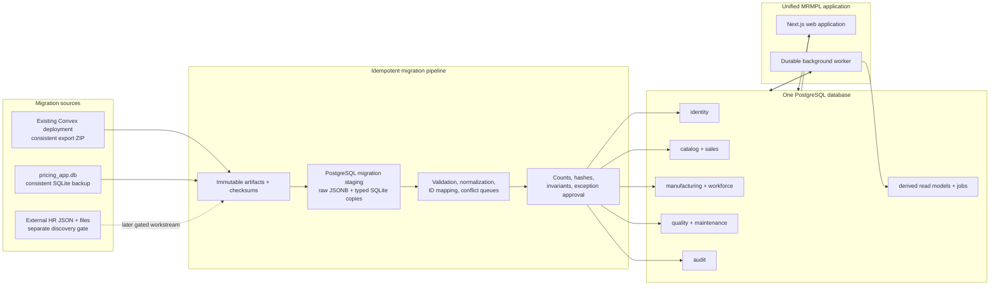

# MRMPL Unified PostgreSQL Migration Specification

Date: 2026-07-18

Status: Approved for phased implementation; Pricing/Convex artifacts are
recovered, while remaining transformations, HR discovery, acceptance, and
cutover gates stay open

Sources:

- `mrm-dashboard`: Convex database and Convex Auth
- `pricing`: SQLite database at `pricing-data/pricing_app.db`
- HR Recruitment: external service and JSON/file persistence; discovery gate
  defined here, but not falsely treated as SQLite data

Target: one PostgreSQL-backed MRMPL application, with Pricing, HR, Operations,
Planning, Quality, Maintenance, and Administration as modules.

## 1. Purpose

This specification defines how to:

1. Replace Convex persistence and subscriptions in `mrm-dashboard`.
2. Replace `better-sqlite3` persistence in `pricing`.
3. Consolidate identity and permissions.
4. preserve current operational history and pricing workflow invariants.
5. Move both applications into one PostgreSQL-backed deployment without
   creating a new cloud Convex deployment.

This is a migration contract. Implementation must not silently change the
source-to-target mappings, conflict policy, or acceptance gates documented
below.

## 2. Decision summary

| Decision                | Specification                                                                                                                                                                            |
| ----------------------- | ---------------------------------------------------------------------------------------------------------------------------------------------------------------------------------------- |
| Target database         | One managed PostgreSQL database, PostgreSQL 16 or newer                                                                                                                                  |
| Database separation     | PostgreSQL schemas separate identity, catalog, sales, manufacturing, quality, maintenance, workforce, audit, derived state, and migration staging                                        |
| Application ownership   | `mrm-dashboard` becomes the target project; Pricing and HR become modules inside its application shell                                                                                   |
| Database access         | TypeScript data-access package with checked-in SQL migrations; Drizzle is the recommended query/schema layer, but handwritten SQL remains allowed for complex reports and bulk migration |
| Primary keys            | Application-generated UUIDs; every migrated row also retains immutable source provenance                                                                                                 |
| Money and rates         | PostgreSQL `numeric`, never floating-point                                                                                                                                               |
| Timestamps              | `timestamptz` in UTC; business dates use `date`; naïve source timestamps are interpreted in `Asia/Calcutta` unless a source field proves otherwise                                       |
| JSON use                | `jsonb` only for immutable calculation snapshots, raw import evidence, audit details, and temporarily derived dashboard payloads—not for core entity identity or relationships           |
| Authentication          | Fresh Better Auth installation on PostgreSQL; legacy Convex Auth and SQLite accounts are not migrated                                                                                    |
| Cutover                 | Rehearsed maintenance-window cutover with a short write freeze; no cross-database dual-write system in the initial migration                                                             |
| Convex extraction       | Consistent export ZIP from the existing deployment; do not create or deploy another Convex backend                                                                                       |
| SQLite extraction       | Online backup for rehearsals; final backup after writes stop and startup migrations/repairs have completed                                                                               |
| Legacy identity         | Exclude users, password credentials, permissions, verification state, and sessions from both source databases                                                                            |
| New users               | Provision a new Better Auth administrator and recreate staff access from approved role/capability assignments                                                                            |
| Dashboard subscriptions | Replace Convex live subscriptions with a durable PostgreSQL read-model job and client invalidation/polling                                                                               |
| Redis                   | Optional disposable acceleration for rate limits, caches, permission caching, and invalidation; never a source of business correctness                                                   |
| Rollback                | Legacy sources stay read-only and intact through the acceptance window; writes are enabled in PostgreSQL only after read-only smoke acceptance                                           |

## 3. Scope

### In scope

- PostgreSQL schemas, keys, constraints, indexes, and migration conventions
- Convex application tables and `dataEntries` logical entities; Auth tables
  are identified only so the loader can exclude them
- SQLite pricing schema and startup migrations
- Fresh Better Auth schema, administrator provisioning, and application
  capability definitions
- Source extraction, staging, transformation, reconciliation, validation,
  cutover, and rollback
- Replacement of the Convex snapshot refresh mechanism
- File/attachment metadata and external-file reconciliation
- Local-only Convex testing when useful

### Out of scope

- Rewriting business formulas or changing approved pricing rules
- Changing planning algorithms during the database migration
- Deploying a new Convex cloud project or deployment
- Dropping the old databases immediately after cutover
- Inventing an HR schema from the proxy UI without auditing the HR service
- Automatic fuzzy merging of product, part, employee, or machine identities
- Migrating legacy users, passwords, permissions, verification records, or
  sessions

## 4. Source inventories

### 4.1 Convex source

The static audit is recorded in
`docs/convex-static-schema-data-flow-audit.md`.

The application defines:

- 14 application tables
- 22 explicit indexes
- external Convex Auth tables from `@convex-dev/auth`, explicitly excluded from
  transformation and canonical import
- 12 canonical tables feeding the dashboard snapshot
- one generic `dataEntries` table representing at least 25 snapshot-eligible
  logical types
- one polymorphic append-only `corrections` overlay
- two derived snapshot/refresh tables

Canonical application tables:

- `productionEntries`
- `attendanceRecords`
- `trainingRecords`
- `routeSelections`
- `plannerPriorities`
- `machineConstraints`
- `planOverrides`
- `routeChanges`
- `dispatchApprovals`
- `setupCompletions`
- `dataEntries`
- `corrections`

Derived tables:

- `dashboardSnapshotChunks`
- `dashboardRefreshState`

The derived tables are not canonical migration inputs. They may be retained in
the immutable raw export but must not be copied into PostgreSQL as source
business tables.

### 4.2 SQLite source

`pricing/src/lib/db.ts` creates 42 final tables. A forty-third name,
`bulk_price_revisions_new`, is a transitional table used while repairing an
older SQLite schema and is not part of the final model.

The database:

- lives at `pricing-data/pricing_app.db`
- uses WAL mode
- enables SQLite foreign keys
- runs a 746-line `migrate()` function whenever the process first opens the
  connection
- contains additive column migrations, table reconstruction, data backfills,
  and historical repair functions
- uses explicit `better-sqlite3` transactions for multi-row workflows

Final source-table groups:

| Group                   | SQLite tables                                                                                                                                                                                                                                                                     |
| ----------------------- | --------------------------------------------------------------------------------------------------------------------------------------------------------------------------------------------------------------------------------------------------------------------------------- |
| Excluded identity       | `app_users`, `app_user_permissions`, `app_sessions`; inventoried but not imported                                                                                                                                                                                                 |
| Control                 | `counters`                                                                                                                                                                                                                                                                        |
| Customers and enquiries | `customers`, `enquiries`, `enquiry_items`, `clarification_tasks`, `enquiry_import_reviews`, `enquiry_import_review_rows`, `followups`, `attachments`                                                                                                                              |
| Product/catalog         | `products`, `bom_lines`, `drawing_history`, `website_product_entries`, `design_categories`, `design_subcategories`, `design_processes`, `product_machine_types`, `product_grades`, `product_rod_types`, `website_applications`, `website_certifications`, `website_field_options` |
| Design workflow         | `design_tasks`, `design_bom_lines`                                                                                                                                                                                                                                                |
| Quotes and pricing      | `quote_items`, `quote_package_components`, `price_master`, `quote_material_rates`, `quote_shipping_terms`, `quote_packaging_options`, `quote_terms`, `quote_commercial_terms`                                                                                                     |
| Orders                  | `purchase_orders`, `purchase_order_lines`                                                                                                                                                                                                                                         |
| Price revisions         | `bulk_price_revisions`, `bulk_price_revision_changes`, `engineering_change_notes`, `engineering_change_note_decisions`                                                                                                                                                            |
| Audit                   | `correction_logs`                                                                                                                                                                                                                                                                 |

### 4.3 HR Recruitment source boundary

The checked-in pricing project does not contain HR recruitment records.
`/hr` authenticates the user, checks page permissions, and renders an iframe to
an external backend. Existing deployment documentation identifies:

- `recruitment_data.json`
- a `resumes/` directory
- a separate Python service
- the SQLite pricing database as the central authentication source

Therefore:

1. Legacy identity and HR page grants are not migrated. HR capabilities are
   recreated in the fresh authorization model.
2. Recruitment business data is not covered until the external service,
   JSON shape, resume metadata, and file set are audited.
3. The unified application must not decommission the HR service until that
   separate audit and import pass acceptance.

## 5. Target architecture



### Runtime services

The minimum production topology is:

- one Next.js web service
- one durable worker process
- one managed PostgreSQL database
- object storage or a persistent file service for uploaded documents
- centralized logs, error reporting, database metrics, and backups

The worker and web process use separate PostgreSQL connection pools and the same
schema migration version.

Runtime identity, authorization, Redis, and invalidation ownership is fixed by
`docs/adr/0006-better-auth-redis-runtime.md`. PostgreSQL is authoritative for
sessions and capabilities. Better Auth cookie session caching is disabled for
the initial release, and canonical writes use a transactional PostgreSQL
outbox before optional Redis invalidation.

## 6. PostgreSQL conventions

### 6.1 Schemas

| Schema          | Responsibility                                                       |
| --------------- | -------------------------------------------------------------------- |
| `identity`      | Users, credentials, roles, permissions, sessions                     |
| `core`          | Organization, shared number sequences, shared file metadata          |
| `catalog`       | Products/parts, aliases, materials, grades, machines, shared masters |
| `sales`         | Customers, enquiries, quotes, pricing, purchase orders               |
| `manufacturing` | Work orders, routes, setups, production, workflow and planner events |
| `workforce`     | Employees, attendance, training                                      |
| `quality`       | Inspections, parameters, rejections, setup checklists                |
| `maintenance`   | Definitions, checklists, schedules, tasks                            |
| `audit`         | Immutable audit events, imported corrections, reversals              |
| `derived`       | Dashboard read models, refresh watermarks, durable jobs              |
| `migration`     | Raw staging, ID maps, conflicts, validation results                  |

### 6.2 Shared columns

Canonical mutable tables use:

```text
id                 uuid primary key
organization_id    uuid not null
created_at         timestamptz not null
updated_at         timestamptz not null
created_by_user_id uuid null
updated_by_user_id uuid null
row_version        bigint not null default 1
```

Imported rows also use:

```text
source_system      text not null
source_table       text not null
source_id          text not null
source_payload     jsonb null
```

The complete raw payload does not have to remain on every canonical row if it
is retained in `migration` staging and the immutable migration archive.

### 6.3 Types

- Currency amount: `numeric(18,6)`
- Rate, weight, quantity: `numeric(20,8)` unless a tighter domain precision is
  proven
- Integer counts: `integer` or `bigint`
- Boolean: `boolean`, including conversion from SQLite `0/1` and text booleans
- Instant: `timestamptz`
- Local business date: `date`
- Local wall-clock time: `time`
- Identifiers and codes: trimmed `text`; case-insensitive uniqueness is
  implemented with normalized generated columns or unique indexes on
  `lower(code)`
- Status: `text` with check constraints for stable sets; do not introduce
  PostgreSQL enum types during the migration

### 6.4 Integrity rules

- Every migrated business key gets a database unique constraint after conflicts
  are resolved.
- Every resolvable relationship becomes a foreign key.
- Fuzzy text matching is never used to create a foreign key automatically.
- Constraints may be loaded as `NOT VALID` during bulk import, but every
  constraint must be validated before cutover.
- Deletion defaults to restriction. Cascades are allowed only for true
  aggregates such as enquiry review rows, BOM children, or expired sessions.
- Operational event/history rows are append-only. Reversal is explicit.
- Actor fields reference `identity.users`; original free-text actor values are
  retained as legacy evidence when no user can be resolved.

## 7. Target domain model

The table list below is the target logical contract. Implementation may split a
very wide table into value/snapshot child tables, but may not collapse these
bounded contexts back into a generic `payload:any` store.

### 7.1 Identity and access

Better Auth owns:

- `identity.users`
- `identity.accounts`
- `identity.sessions`
- `identity.verifications`

The MRMPL authorization layer owns:

- `identity.roles`
- `identity.permissions`
- `identity.user_roles`
- `identity.role_permissions`
- `identity.user_permission_overrides`

Rules:

- Better Auth uses its PostgreSQL/Drizzle adapter and UUID identifiers.
- The migration creates no Better Auth user, account, session, or verification
  row from either source database.
- The first administrator is provisioned through an explicit one-time command
  after the target schema is deployed.
- One user may be connected to one workforce employee, but user and employee
  are not the same entity.
- Permissions use stable capability keys, not URL strings as their only
  identity.
- Existing Pricing and HR page keys seed permission definitions only, not
  legacy user grants.
- Operations, quality, maintenance, planning, and HR capabilities are added
  explicitly.
- Historical free-text actors remain on imported business records and are not
  automatically linked to new Better Auth users.

### 7.2 Shared catalog

- `core.organizations`
- `core.number_sequences`
- `core.files`
- `core.file_links`
- `catalog.items`
- `catalog.item_aliases`
- `catalog.item_categories`
- `catalog.item_subcategories`
- `catalog.bom_lines`
- `catalog.material_grades`
- `catalog.rod_types`
- `catalog.machine_types`
- `catalog.machines`
- `catalog.design_processes`
- `catalog.drawings`
- `catalog.website_product_profiles`
- `catalog.website_applications`
- `catalog.website_certifications`
- `catalog.website_field_options`

`catalog.items` is the canonical product/part identity. It holds the Pricing
product lifecycle (`Q`, `M`, `P`, package/assembly/list) without assuming that
every dashboard part string is already the same identifier.

`catalog.item_aliases` supports:

- Pricing `products.uid`
- converted-from quote UID
- dashboard `partNo`/`partCode`
- customer part codes
- legacy spreadsheet aliases

Exact aliases can produce candidate matches. Conflicting or ambiguous aliases
must enter `migration.identity_conflicts`.

### 7.3 Sales and pricing

- `sales.customers`
- `sales.customer_contacts`
- `sales.enquiries`
- `sales.enquiry_items`
- `sales.enquiry_item_revisions`
- `sales.design_tasks`
- `sales.design_bom_lines`
- `sales.clarification_tasks`
- `sales.enquiry_import_reviews`
- `sales.enquiry_import_review_rows`
- `sales.followups`
- `sales.quote_items`
- `sales.quote_product_snapshots`
- `sales.quote_package_components`
- `sales.material_rates`
- `sales.shipping_terms`
- `sales.packaging_options`
- `sales.quote_terms`
- `sales.commercial_terms`
- `sales.purchase_orders`
- `sales.purchase_order_lines`
- `sales.bulk_price_revisions`
- `sales.bulk_price_revision_changes`
- `sales.engineering_change_notes`
- `sales.engineering_change_decisions`

Pricing invariants from `pricing/docs/workflow-audit.md` remain acceptance
criteria, including:

- immutable sent quote history
- one active price per customer, customer part code, and product lineage
- package/assembly immediate-child snapshots
- supersession within the same product lineage
- unambiguous PO matching
- PI approval and product conversion behavior

The legacy SQLite `price_master` table is loaded into staging. The current audit
says it is unused and empty. It receives no canonical target table unless the
production backup proves it contains required rows.

### 7.4 Manufacturing and planning

- `manufacturing.work_orders`
- `manufacturing.raw_material_receipts`
- `manufacturing.route_options`
- `manufacturing.operation_setups`
- `manufacturing.operation_cycle_standards`
- `manufacturing.operation_tooling`
- `manufacturing.route_selections`
- `manufacturing.production_entries`
- `manufacturing.production_cards`
- `manufacturing.production_card_events`
- `manufacturing.shop_floor_setup_state`
- `manufacturing.shop_floor_stage_events`
- `manufacturing.planner_priority_events`
- `manufacturing.machine_constraint_events`
- `manufacturing.plan_override_events`
- `manufacturing.route_change_events`
- `manufacturing.dispatch_approval_events`
- `manufacturing.setup_completion_events`
- `manufacturing.planning_calendar_exceptions`
- `manufacturing.downtime_reasons`

Planner records remain events because the source stores decisions and nested
snapshots. Nested interrupted setups, queue blockers, placements, and remaining
setups become child event-detail tables rather than JSON arrays when they carry
joinable identities.

Machine locking uses transactions and constraints:

- one current shop-floor state per work order, route option, and setup
- one active physical-machine assignment per setup state
- planner override validation inside the same PostgreSQL transaction
- `SELECT ... FOR UPDATE` or advisory locking on the setup identity
- no fixed 500/1,000-row history scan

### 7.5 Workforce

- `workforce.employees`
- `workforce.employee_aliases`
- `workforce.attendance_records`
- `workforce.training_records`

The Convex employee master is the temporary employee authority for Operations.
The future HR migration may enrich or supersede it only through an explicit
employee reconciliation pass.

### 7.6 Quality

- `quality.rejection_types`
- `quality.rejection_reasons`
- `quality.rejection_remarks`
- `quality.parameter_definitions`
- `quality.first_piece_inspections`
- `quality.first_piece_readings`
- `quality.hourly_checks`
- `quality.hourly_check_readings`
- `quality.setup_checklist_templates`
- `quality.setup_checklist_template_items`
- `quality.setup_checklist_sessions`
- `quality.setup_checklist_results`

Quality parameters are linked to item, route option, and setup by foreign key.
Generated parameter codes remain unique inside that scope.

### 7.7 Maintenance

- `maintenance.definitions`
- `maintenance.checklist_items`
- `maintenance.machine_schedules`
- `maintenance.tasks`
- `maintenance.task_results`

Machine schedules reference `catalog.machines`; maintenance definitions and
checklist steps use enforced keys.

### 7.8 Audit, correction, and provenance

- `audit.events`
- `audit.record_reversals`
- `audit.legacy_convex_corrections`
- `audit.legacy_pricing_corrections`

Migration behavior:

1. Preserve every source correction record.
2. Resolve each target when possible through `migration.source_id_map`.
3. Materialize current live/reversed state on the target event row.
4. Insert an immutable `audit.record_reversals` row with actor, reason,
   original timestamp, and source correction ID.
5. Quarantine orphan or ambiguous corrections; never silently discard them.

### 7.9 Derived dashboard state

- `derived.dashboard_read_models`
- `derived.refresh_jobs`
- `derived.refresh_watermarks`
- `derived.outbox_events`

The initial PostgreSQL version may retain the current JavaScript planning
analysis and output one JSONB read model per organization/version. It must not
retain 650 KB string chunking.

Refresh flow:

1. A planning-impacting transaction commits canonical changes.
2. The same transaction upserts one coalesced refresh job.
3. A worker claims it with `FOR UPDATE SKIP LOCKED`.
4. The worker reads canonical rows at a consistent transaction snapshot.
5. Existing analysis code produces the dashboard payload.
6. The worker writes a new version and source watermark atomically.
7. The client invalidates/polls the version endpoint and fetches changed data.

Outbox delivery and refresh work use idempotency keys. Redis loss may delay a
cache invalidation but may not lose a canonical write or durable refresh job.

Specialized screens should query normalized tables directly. The derived JSONB
model is a compatibility bridge, not the final universal query API.

## 8. Source-to-target mappings

### 8.1 Convex physical tables

| Convex table              | PostgreSQL target                                                | Rule                                                |
| ------------------------- | ---------------------------------------------------------------- | --------------------------------------------------- |
| Auth tables               | no staging or canonical import                                   | Exclude users, accounts, verification, and sessions |
| `productionEntries`       | `manufacturing.production_entries`                               | Preserve typed values and source ID                 |
| `attendanceRecords`       | `workforce.attendance_records`                                   | Resolve operator alias; quarantine unresolved       |
| `trainingRecords`         | `workforce.training_records`                                     | Resolve employee/trainer where possible             |
| `routeSelections`         | `manufacturing.route_selections`                                 | Resolve work order and option                       |
| `plannerPriorities`       | `manufacturing.planner_priority_events` plus child detail rows   | Preserve full decision snapshot                     |
| `machineConstraints`      | `manufacturing.machine_constraint_events` plus child detail rows | Resolve machines and date window                    |
| `planOverrides`           | `manufacturing.plan_override_events` plus child detail rows      | Preserve source/target machine                      |
| `routeChanges`            | `manufacturing.route_change_events` plus remaining-setup rows    | Preserve route transition                           |
| `dispatchApprovals`       | `manufacturing.dispatch_approval_events`                         | Map actor when possible                             |
| `setupCompletions`        | `manufacturing.setup_completion_events`                          | Map setup/machine/actor                             |
| `dataEntries`             | decomposed by `entryType`                                        | See next section                                    |
| `corrections`             | `audit.legacy_convex_corrections`, reversals, and target state   | Preserve all; quarantine orphans                    |
| `dashboardSnapshotChunks` | no canonical import                                              | Keep only in raw archive                            |
| `dashboardRefreshState`   | no canonical import                                              | Initialize new derived state after load             |

### 8.2 Convex `dataEntries`

| `entryType`                                                                               | PostgreSQL target                                                              |
| ----------------------------------------------------------------------------------------- | ------------------------------------------------------------------------------ |
| `employee`                                                                                | `workforce.employees`                                                          |
| `machine_master`                                                                          | `catalog.machines`                                                             |
| `route`                                                                                   | `manufacturing.route_options` and `manufacturing.operation_setups`             |
| `cycle`                                                                                   | `manufacturing.operation_cycle_standards`                                      |
| `tooling`                                                                                 | `manufacturing.operation_tooling`                                              |
| `work_order`                                                                              | `manufacturing.work_orders`                                                    |
| `rm_inward`                                                                               | `manufacturing.raw_material_receipts`                                          |
| `planning_holiday`                                                                        | `manufacturing.planning_calendar_exceptions`                                   |
| `setup_checklist_master`                                                                  | quality checklist template/items                                               |
| `setup_checklist_session`                                                                 | quality checklist session/results                                              |
| `setup_checklist`                                                                         | legacy checklist staging, then template/session mapping                        |
| `shop_floor_status`                                                                       | shop-floor state and stage events                                              |
| `first_piece_inspection_master`                                                           | legacy quality parameter/template staging                                      |
| `first_piece_inspection_report`                                                           | first-piece inspection/readings                                                |
| `quality_parameter_master`                                                                | quality parameter definitions                                                  |
| `hourly_quality_check`                                                                    | hourly checks/readings                                                         |
| `production_card`                                                                         | production cards/events                                                        |
| `software_raw`                                                                            | production entries with explicit legacy provenance                             |
| `maintenance_master`                                                                      | maintenance definitions                                                        |
| `maintenance_checklist_master`                                                            | maintenance checklist items                                                    |
| `maintenance_schedule`                                                                    | machine schedules                                                              |
| `maintenance_task`                                                                        | maintenance tasks/results                                                      |
| `rejection_type_master`                                                                   | rejection types                                                                |
| `rejection_reason_master`                                                                 | rejection reasons                                                              |
| `rejection_remark_master`                                                                 | rejection remarks                                                              |
| `downtime_reason_master`                                                                  | downtime reasons                                                               |
| `dispatch`                                                                                | dispatch compatibility staging, then dispatch event mapping                    |
| `meeting_action`                                                                          | audit/workflow action staging pending domain approval                          |
| `rejection_classification`, `raw_material_plan`, `machine_planning`, `quality_inspection` | typed migration quarantine until payload inventory defines an approved mapping |

Unknown `entryType` values go to `migration.unmapped_convex_entries`. The
migration fails its completeness gate while any non-approved unknown type
remains.

### 8.3 SQLite tables

| SQLite table                        | PostgreSQL target                                              |
| ----------------------------------- | -------------------------------------------------------------- |
| `app_users`                         | no staging or canonical import                                 |
| `app_user_permissions`              | no staging or canonical import                                 |
| `app_sessions`                      | no staging or canonical import                                 |
| `counters`                          | `core.number_sequences`; preserve last allocated values        |
| `customers`                         | `sales.customers`                                              |
| `enquiries`                         | `sales.enquiries`                                              |
| `enquiry_items`                     | `sales.enquiry_items` and revision fields                      |
| `clarification_tasks`               | `sales.clarification_tasks`                                    |
| `enquiry_import_reviews`            | same logical target in `sales`                                 |
| `enquiry_import_review_rows`        | same logical target in `sales`                                 |
| `followups`                         | `sales.followups`                                              |
| `attachments`                       | `core.files` and enquiry file links                            |
| `products`                          | `catalog.items` plus costing attributes                        |
| `bom_lines`                         | `catalog.bom_lines`                                            |
| `drawing_history`                   | `catalog.drawings`                                             |
| `website_product_entries`           | `catalog.website_product_profiles`                             |
| `design_categories`                 | `catalog.item_categories`                                      |
| `design_subcategories`              | `catalog.item_subcategories`                                   |
| `design_processes`                  | `catalog.design_processes`                                     |
| `product_machine_types`             | `catalog.machine_types` aliases                                |
| `product_grades`                    | `catalog.material_grades` aliases                              |
| `product_rod_types`                 | `catalog.rod_types`                                            |
| `website_applications`              | same logical target in `catalog`                               |
| `website_certifications`            | same logical target in `catalog`                               |
| `website_field_options`             | same logical target in `catalog`                               |
| `design_tasks`                      | `sales.design_tasks`                                           |
| `design_bom_lines`                  | `sales.design_bom_lines`                                       |
| `quote_items`                       | `sales.quote_items` plus `sales.quote_product_snapshots`       |
| `quote_package_components`          | `sales.quote_package_components`                               |
| `price_master`                      | staging/quarantine unless production rows prove it is required |
| `quote_material_rates`              | `sales.material_rates`                                         |
| `quote_shipping_terms`              | `sales.shipping_terms`                                         |
| `quote_packaging_options`           | `sales.packaging_options`                                      |
| `quote_terms`                       | `sales.quote_terms`                                            |
| `quote_commercial_terms`            | `sales.commercial_terms`                                       |
| `purchase_orders`                   | `sales.purchase_orders`                                        |
| `purchase_order_lines`              | `sales.purchase_order_lines`                                   |
| `bulk_price_revisions`              | `sales.bulk_price_revisions`                                   |
| `bulk_price_revision_changes`       | `sales.bulk_price_revision_changes`                            |
| `engineering_change_notes`          | `sales.engineering_change_notes`                               |
| `engineering_change_note_decisions` | `sales.engineering_change_decisions`                           |
| `correction_logs`                   | `audit.legacy_pricing_corrections` and audit events            |

## 9. Fresh Better Auth initialization

### 9.1 Schema ownership

Better Auth owns users, credential accounts, sessions, and verification state.
Its Drizzle schema is generated from the pinned Better Auth configuration and
then committed as a normal numbered PostgreSQL migration.

MRMPL owns roles, capabilities, role grants, and per-user overrides. Better
Auth's Admin plugin may manage user lifecycle and coarse administrative roles,
but operational authorization is enforced by MRMPL capability checks.

### 9.2 Initial provisioning

1. Apply the Better Auth and MRMPL authorization schemas.
2. Seed capability definitions for Pricing, Operations, Planning, Quality,
   Maintenance, HR, and Administration.
3. Run an explicit one-time command to create the first administrator.
4. Create new staff accounts and assign approved roles/capabilities.
5. Disable the bootstrap command or rotate its one-time secret immediately.

Public self-registration is not part of the initial production release.

### 9.3 Legacy-auth exclusion

The migration loader deny-lists:

- all Convex Auth/component tables
- SQLite `app_users`
- SQLite `app_user_permissions`
- SQLite `app_sessions`

These rows do not enter staging, `migration.source_id_map`, Better Auth tables,
or canonical audit tables. A source artifact may physically contain them, but
working extracts must exclude them and access to the sealed source artifact
must follow the shortest approved retention period.

### 9.4 Historical actors

Imported business records retain legacy actor strings such as approver,
completer, or corrector. They remain provenance text and are not automatically
resolved to new Better Auth users.

New writes always derive actor identity from the authenticated Better Auth
session. Client-supplied actor strings are not authoritative.

## 10. Cross-source entity reconciliation

### Products and manufacturing parts

- Pricing `products.uid` becomes a catalog item alias.
- Dashboard part strings become catalog item aliases.
- Exact, unique, normalized alias matches may be proposed automatically.
- A proposed match becomes canonical only after it passes uniqueness and
  relationship checks.
- Conflicting matches remain separate items until approved.

### Employees and users

- Employee IDs remain workforce identifiers.
- Usernames/emails remain authentication identifiers.
- An employee-to-user link is optional and explicitly approved.
- Free-text historical actor names remain preserved even after a user mapping.

### Machines and machine types

- Physical machine number and machine type are different entities.
- Dashboard machine master creates physical machines.
- Pricing product machine types seed type aliases.
- Routes and production rows resolve to machine type or physical machine as
  their source semantics require.

### Production sources

The current dashboard uses `software_raw` whenever any such rows exist;
otherwise it uses `productionEntries`. PostgreSQL must not preserve this
all-or-nothing implicit precedence.

Migration must:

1. Load both sources with provenance.
2. Generate an overlap report using date, job card, part, setup, machine,
   operator, and quantities.
3. Classify exact duplicates, conflicting duplicates, and unique rows.
4. Apply an approved deterministic deduplication rule.
5. Retain rejected duplicates in migration evidence.

No production source is dropped merely because the other source is nonempty.

## 11. Migration pipeline

### 11.1 Repository layout

Recommended additions inside `mrm-dashboard`:

```text
packages/db/
  src/schema/
  src/client/
  migrations/

packages/migration/
  src/extract/
  src/load/
  src/transform/
  src/reconcile/
  src/commands/
  fixtures/

apps/worker/
```

All migration commands use TypeScript and `pnpm`. Scripts accept explicit
source and target paths; they must not silently select a cloud deployment.

### 11.2 Immutable artifacts

Each migration run creates a manifest:

```text
run_id
created_at
git_commit
source kind
source artifact path
SHA-256
byte size
table list
row counts
extract command/version
target migration version
operator
```

Raw exports are immutable and encrypted at rest. They are never committed.

### 11.3 Staging

Convex documents load into:

- `migration.convex_documents`
- source table
- Convex `_id`
- Convex `_creationTime`
- raw JSONB document
- artifact/run ID

The loader rejects every Convex Auth/component table before inserting working
staging rows.

SQLite tables first load into typed staging tables matching the final SQLite
schema. This makes SQLite type conversion and foreign-key validation
observable before target transformation.

The three excluded SQLite auth tables are recorded in the artifact manifest
but are not copied into working staging.

Large loads use PostgreSQL `COPY`. The official PostgreSQL documentation
defines `COPY` as the bulk data movement primitive:
[PostgreSQL COPY](https://www.postgresql.org/docs/current/sql-copy.html).

### 11.4 Source ID map

```text
migration.source_id_map
  source_system
  source_table
  source_id
  target_schema
  target_table
  target_id
  migration_run_id
  transformation_version
```

Unique key:

```text
(source_system, source_table, source_id)
```

Every loader is an idempotent upsert keyed through this table. Rerunning the
same artifact must not create new target entities.

### 11.5 Conflict queues

- `migration.identity_conflicts`
- `migration.relationship_conflicts`
- `migration.type_conflicts`
- `migration.unknown_entry_types`
- `migration.orphan_corrections`
- `migration.file_conflicts`

Every record has status, proposed resolution, approved resolution, approver,
timestamp, and evidence JSONB.

## 12. Implementation phases

### Phase 0 — Freeze the contract

Deliver:

- this approved specification
- target schema ADR
- data classification and retention rules
- deployment environment selection
- named migration owner and business approvers

Exit gate:

- no unresolved architecture decision that changes identifiers, auth, or
  source authority

### Phase 1 — Measure both sources

Convex:

- acquire a consistent export from the existing deployment
- inventory application tables and every `dataEntries.entryType`
- confirm Auth/component tables are excluded from the working extract
- profile payload fields and observed types
- count duplicate logical keys and orphan corrections
- measure production source overlap

Convex officially exports a consistent ZIP with
`<table_name>/documents.jsonl`. The CLI supports explicit production or local
selection:
[Convex export reference](https://docs.convex.dev/cli/reference/export),
[Convex backups](https://docs.convex.dev/database/backup-restore).

The production command belongs in the cutover/rehearsal runbook and must never
be run accidentally against the default development deployment:

```sh
npx convex export --prod --path <approved-secure-path>/convex-snapshot.zip
```

SQLite:

- run the pinned current application version once so startup migrations finish
- take a consistent backup
- run `PRAGMA integrity_check`
- run `PRAGMA foreign_key_check`
- inventory rows, schema, indexes, triggers, and file references
- run the existing workflow audit

Exit gate:

- source manifests complete
- all distinct Convex entry types classified
- HR scope explicitly accepted as deferred or separately inventoried

### Phase 2 — Build PostgreSQL foundation

Deliver:

- schemas and migration tooling
- generated Better Auth PostgreSQL/Drizzle schema
- MRMPL role/capability schema and initial capability seed
- one-time initial-administrator provisioning command
- source provenance and conflict tables
- core catalog, sales, and manufacturing tables
- constraints and indexes
- local PostgreSQL development environment
- CI migration test from empty database

Exit gate:

- schema can be created from zero
- migration is reversible before data load
- database roles and least-privilege grants tested

### Phase 3 — Port Pricing persistence

Pricing is migrated first because its SQLite schema is already relational.

Steps:

1. Replace `getDb()` with a PostgreSQL client boundary.
2. Port each server action transaction.
3. Replace SQLite placeholders, date functions, and last-insert semantics.
4. Preserve quote/product snapshot behavior.
5. Port the 38 workflow audit checks to PostgreSQL.
6. Run the Pricing module against a migrated rehearsal database.

Do not run historical SQLite repair functions on every PostgreSQL connection.
Convert any still-required repair into a numbered, one-time SQL/data migration.

Exit gate:

- Pricing tests pass
- workflow audit has no new findings
- representative pricing calculations match source values within declared
  decimal tolerance

### Phase 4 — Port dashboard canonical writes

Implement normalized repositories for:

- masters
- work orders/routes/setups
- planning actions
- production
- shop-floor workflow
- quality
- maintenance
- corrections/reversals

Writes use PostgreSQL transactions. The application may temporarily use a
compatibility adapter shaped like the current Convex functions, but the adapter
must call typed repositories rather than generic `dataEntries`.

Exit gate:

- every current Convex mutation has a PostgreSQL equivalent
- business-key uniqueness is enforced
- machine locking is transactionally tested
- reversal behavior matches source fixtures

### Phase 5 — Port dashboard reads and derived state

Steps:

1. Port direct master, hourly-quality, and setup-checklist queries.
2. Add durable refresh jobs and versioned read models.
3. Reuse the current planning analysis against normalized query results.
4. Replace `useQuery`/`useMutation` with the target client/data layer.
5. Replace live subscriptions with explicit invalidation and bounded polling.
6. Remove chunk serialization.

Exit gate:

- main dashboard and specialized screens match source fixtures
- refresh status is observable
- failed jobs retry without duplicate read models
- no screen depends on Convex-generated APIs

### Phase 6 — Rehearsal migrations

Run at least two full rehearsals from immutable source artifacts.

Each rehearsal records:

- extraction duration
- staging duration
- transformation duration
- conflict counts
- reconciliation results
- read-model build duration
- application smoke results
- total predicted cutover window

Local Convex may be started for sanitized fixture/codegen tests only. It must
use the explicit local deployment configuration. No new deployed Convex server
is needed for rehearsal or migration.

Exit gate:

- two consecutive idempotent runs produce identical row counts and hashes
- no unexplained conflicts
- cutover fits the approved maintenance window

### Phase 7 — Production cutover

Follow the runbook in Section 13.

### Phase 8 — Stabilize and retire

- keep old sources read-only through the retention window
- monitor reconciliation counters and job lag
- remove compatibility adapters only after usage reaches zero
- retire Convex and SQLite credentials
- securely archive or destroy raw exports per retention policy

## 13. Production cutover runbook

### T-7 days

- freeze schema-changing feature work
- complete final rehearsal
- confirm managed PostgreSQL backups and point-in-time recovery
- confirm connection limits, worker deployment, object storage, and secrets
- notify users of maintenance
- prepare exact commits and rollback artifacts

### T-1 day

- run non-authoritative preview exports/backups
- resolve all new conflicts
- verify disk space and artifact encryption
- run target schema migrations
- verify target database is empty or belongs to the approved migration run

### T0 — Enter maintenance mode

1. Block all writes in both applications.
2. Keep read-only status visible to users.
3. Stop scheduled/import/background write paths.
4. Record the cutover timestamp and source versions.

### T+ — Final extraction

Convex:

- take/export one consistent snapshot from the existing production deployment
- include file storage only if inventory proves it is used
- checksum and seal the ZIP

SQLite:

- stop the Pricing process or otherwise prove no writers remain
- open the final database with the pinned source version so migrations finish
- run integrity and foreign-key checks
- take a backup using the SQLite backup API
- checksum the database and external attachment tree

### Load and transform

1. Load immutable staging.
2. Validate source counts.
3. Build source ID maps.
4. Load reference masters; do not load legacy identity.
5. Load catalog and sales parents.
6. Load sales/pricing children and history.
7. Load manufacturing/workforce/quality/maintenance parents.
8. Load operational events and corrections.
9. Resolve files.
10. Validate all deferred constraints.
11. Build PostgreSQL sequences/counters.
12. Build the first dashboard read model.
13. Provision the initial Better Auth administrator and approved staff
    accounts.

### Read-only acceptance

Deploy the unified application with writes still disabled.

Smoke:

- fresh Better Auth login and MRMPL permission matrix
- Pricing dashboard, enquiry, design, costing, quote, PO/PI, ECN
- Operations snapshot
- planning action screens
- production entry
- shop-floor state
- quality screens
- maintenance screens
- corrections and audit

Compare source and target reports. Business approvers sign off.

### Enable writes

Only after read-only acceptance:

1. Create a PostgreSQL restore point/backup marker.
2. Enable worker processing.
3. Enable application writes.
4. Run one controlled write per critical module.
5. Confirm audit record and derived refresh.
6. Announce service restoration.

## 14. Rollback

### Before PostgreSQL writes are enabled

Rollback is straightforward:

- route users back to the old applications
- remove maintenance mode there
- retain failed target data for diagnosis
- do not mutate source databases during rollback

### After PostgreSQL writes are enabled

The old sources are no longer current. Do not simply reopen them for writes.

Options:

1. Forward-fix PostgreSQL, preferred.
2. Export PostgreSQL changes since the cutover watermark through a tested
   reverse-mapping procedure, then reopen legacy applications.
3. Restore PostgreSQL to the cutover marker only if the business explicitly
   accepts losing post-cutover writes.

The acceptance window is designed to avoid reaching this state with an
unverified system.

## 15. Validation and reconciliation

### 15.1 Structural checks

- source and staging table counts
- source and target row counts by mapping
- distinct business-key counts
- nullability failures
- validated foreign keys
- unique constraints
- timestamp parse failures
- numeric conversion failures
- unknown enum/status values

### 15.2 Hash checks

For stable source rows, compute a canonical hash from normalized business
fields. Store:

- source hash
- transformed target hash
- transformation version
- exception reason

Hash order-independent child collections after sorting by their business key.

### 15.3 Financial checks

- quote totals and approved prices
- product costing inputs and outputs
- package/assembly rollups
- current active prices
- material/shipping/packaging master values
- purchase-order price comparisons
- bulk revision and ECN results

No unexplained difference is accepted. Declared tolerance must reflect decimal
rounding only.

### 15.4 Manufacturing checks

- work orders by status
- route/setup counts
- machine assignments
- production quantity and rejection totals by date/job/machine
- active shop-floor states
- planner decisions by type
- attendance and training counts
- quality/master/check counts
- maintenance schedule/task counts
- live and reversed records

### 15.5 Required source exceptions

The known Pricing audit findings remain visible:

- ambiguous customer code `32046`
- inherited sent timestamps for specified quote rows
- active blank-code child rows not attached to active parents

The migration must not conceal these by changing identifiers or dropping rows.

## 16. Index and query requirements

Minimum indexes include:

- every foreign-key column used in joins
- all normalized unique business keys
- work orders by organization/status/date
- production by organization/date/machine/item/work order
- active shop-floor setup/machine partial indexes
- planner events by target and creation time
- quality checks by item/setup/date/machine
- maintenance tasks by machine/status/due date
- enquiries by customer/status/received date
- quote items by customer/product/status/revision
- purchase orders by customer/PO number/status
- audit events by entity and timestamp
- jobs by status/run-after/queue key

Add indexes from observed `EXPLAIN (ANALYZE, BUFFERS)` plans, not by copying
Convex indexes mechanically.

Performance gates:

- no N+1 correction query path
- no capped-history correctness query
- no full-table scan in normal request paths without an approved small-table
  invariant
- migration jobs use keyset pagination or `COPY`, never offset pagination for
  large data
- worker jobs are bounded, retryable, and observable

## 17. Security and operations

- TLS required for database connections.
- Separate database roles for migration, web, worker, and read-only reporting.
- Web and worker roles cannot create schemas or run migrations.
- Migration credentials expire after cutover.
- Raw exports are treated as confidential production data.
- Password hashes and session records never appear in logs.
- Application secrets use the deployment provider's secret store.
- Automated backups and point-in-time recovery are mandatory.
- Restore drills occur before source retirement.
- Connection pools are sized against the provider's connection limit.
- Long-running reports use a read replica only after correctness is proven on
  the primary.

## 18. Required deliverables

- [ ] Target schema ADR
- [ ] Checked-in PostgreSQL migrations
- [ ] Typed database package
- [ ] Immutable artifact manifest command
- [ ] Convex export loader
- [ ] SQLite backup loader
- [ ] `dataEntries` profiler and transformer
- [ ] Source ID map and conflict-review tooling
- [ ] Better Auth schema/configuration and initial-admin command
- [ ] MRMPL capability seed and staff provisioning procedure
- [ ] Production-source overlap report
- [ ] Correction/reversal transformer
- [ ] File inventory and transfer tool
- [ ] Dashboard read-model worker
- [ ] Ported Pricing workflow audit
- [ ] Manufacturing reconciliation report
- [ ] Full rehearsal reports
- [ ] Cutover command sheet
- [ ] Rollback test report
- [ ] Production acceptance sign-off

## 19. Blocking decisions before implementation

These require explicit business or deployment approval:

1. Managed PostgreSQL provider and region.
2. Maintenance-window duration.
3. Canonical match decisions between Pricing products and dashboard parts.
4. Production `software_raw` versus `productionEntries` deduplication rule.
5. Initial Better Auth administrator identity and staff provisioning owner.
6. Retention duration for raw exports and old databases.
7. Object-storage provider and document retention.
8. Whether HR data migration is part of the same launch or a later release.
9. Owners for pricing, production, quality, maintenance, HR, and access-control
   acceptance.

## 20. Definition of done

The migration is complete when:

- one production PostgreSQL database is the sole writable business datastore
- Pricing and Operations run inside the target application
- all source tables and logical Convex types are accounted for
- all target constraints validate
- all reconciliation reports pass or contain signed exceptions
- the Pricing workflow audit passes
- critical manufacturing workflows pass
- all newly provisioned users can authenticate with approved permissions
- no runtime code imports Convex client/server packages or `better-sqlite3`
- no production code reads `pricing_app.db`
- no dashboard screen depends on `dashboardSnapshotChunks`
- PostgreSQL backup/restore is tested
- rollback conditions are closed or explicitly accepted
- the old Convex deployment and SQLite database remain read-only until the
  agreed retention window expires
